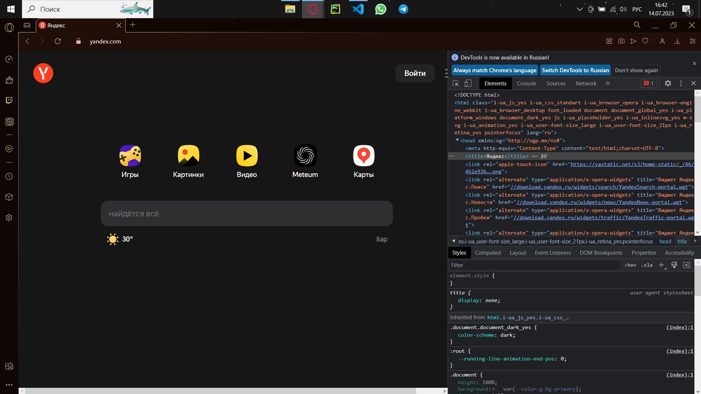
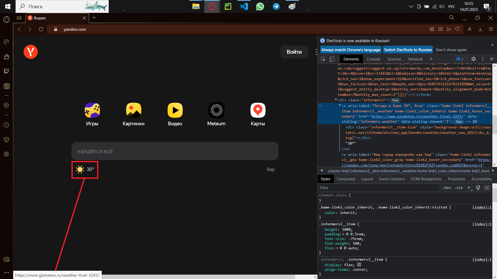

# Задача:
## На основе сайта yandex.ru:
- Определите, на каком протоколе работает сайт.
- Проанализируйте структуру страницы сайта.
- Внесите не менее 10 изменений на страницу с помощью инструмента разработчика и представьте скриншоты было/стало.
- Создайте прототип низкой детализации (дополнительное задание, если на семинаре дошли до задания №8).

### Пункт 1
Сайт yandex.com работает на протоколе HTTPS.

HTTP — это протокол передачи данных между браузером и сервером. HTTPS — это тот же HTTP, но с добавленными методами шифрования данных и проверки безопасности.

### Пункт 2

### Пункт 3
1 изменение:

2 изменение:

3 изменение:

### Пункт 4
