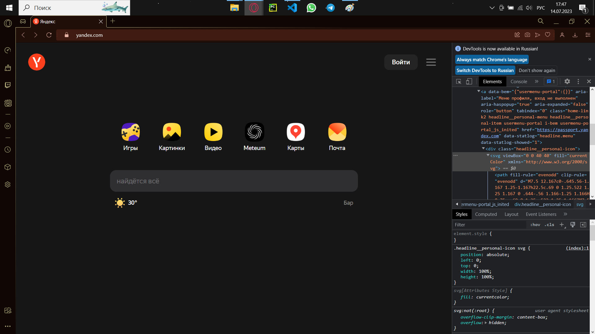

# Задача:
## На основе сайта yandex.ru:
- Определите, на каком протоколе работает сайт.
- Проанализируйте структуру страницы сайта.
- Внесите не менее 10 изменений на страницу с помощью инструмента разработчика и представьте скриншоты было/стало.
- Создайте прототип низкой детализации (дополнительное задание, если на семинаре дошли до задания №8).

### **Пункт 1**
Сайт yandex.com работает на протоколе HTTPS.

HTTP — это протокол передачи данных между браузером и сервером. HTTPS — это тот же HTTP, но с добавленными методами шифрования данных и проверки безопасности.

### **Пункт 2**
Сайт состоит из 2 основных частей:
1. head - верняя часть сайта, где располагается кнопка с изображением логотипа Яндекса, кнопка "войти" и кнопка почты.
2. body - основная часть, в которой расположились 6 кнопок, которые перенаправляют пользователя на иные 6 сервисов от Яндекса. Также в этой части находятся строка поиска и информация о текущей погоде в регионе пользователя.

### **Пункт 3**
***1 изменение:***

Изменено отображаемое название страницы.

***2 изменение:***

Изменён сайт, предоставляющий информацию о погоде.

***3 изменение:***

Изменено название раздела "Игры" на "Развлечения".

***4 изменение:***

Изменена ссылка на игры от Яндекс на ссылку на основную страницу YouTube.

***5 изменение:***

Ссылка на Яндекс.Карты заменена ссылкой на Google Maps.

***6 изменение:***

Изменён цвет текста в разделе погоды.

***7 изменение:***

Изменён цвет фона иконок ("Игры", "Картинки", "Видео", "Meteum", "Карты").

***8 изменение:***

Изменён цвет фона сайта.

***9 изменение:***

Изменены размеры лого Яндекса.

***10 изменение:***

Изменён цвет фона кнопки.
